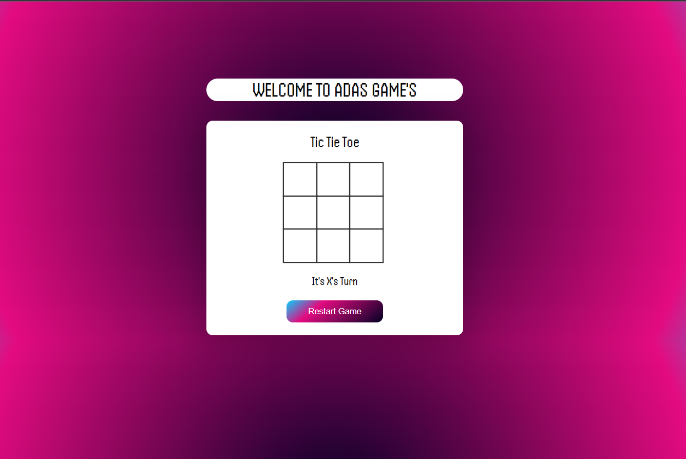

# Tic-Tac-Toe


## Description

Tic-Tac-Toe is a classic two-player paper-and-pencil game played on a 3x3 grid. The players take turns marking their respective symbols ('X' or 'O') on an empty cell in the grid. The first player to align three of their symbols in a row, column, or diagonal wins the game. If the grid is fully occupied without any winner, the game ends in a draw.

This repository contains an implementation of the Tic-Tac-Toe game in JavaScript. It provides a simple and interactive command-line interface to play the game.

## Features

- Human vs. Human: Play against a friend on the same computer.
- Human vs. AI: Test your skills against an AI opponent.
- AI vs. AI: Sit back and watch two AI players battle it out.

## Requirements

- [List the prerequisites and dependencies here, e.g., Node.js]

## Installation

1. Clone the repository:

```bash
git clone https://github.com/adas0mahdi/tic-tac-toe.git
cd tic-tac-toe

How to Play
1. The game board is represented as a 3x3 grid.
2. Players take turns to enter the row and column coordinates (e.g., "1 2") where they want to place their symbol ('X' or 'O').
3. The game ends when either player aligns three symbols in a row, column, or diagonal or when the grid is fully occupied without a winner (a draw).
4. Enjoy the game and have fun!


License
This project is licensed under the MIT License - see the LICENSE file for details.

Contact
If you have any questions, suggestions, or just want to say hi, feel free to contact the project maintainers at [adas0mahdi@gmail.com].

```

<br>
<br>
<br>
<br>
 
. 

